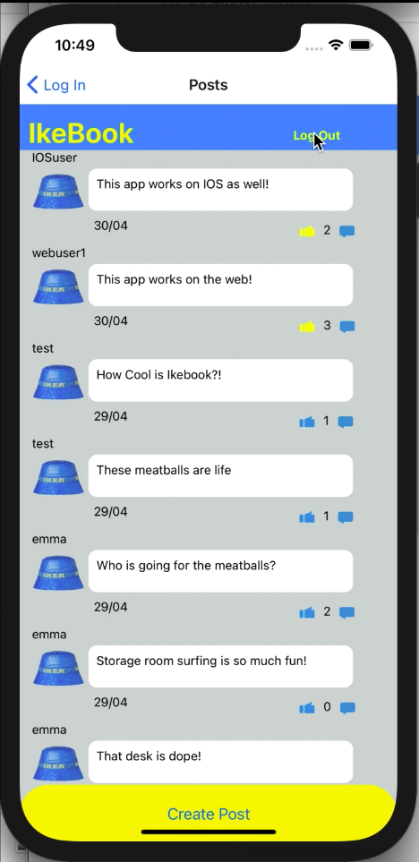

## Acebook 



This is the front end repository for Makers group project to create a facebook clone (styled like Ikea). The back end API (in Ruby on Rails) is hosted on Heroku and the repository is [here](https://github.com/fg24davies/acebook-insert-team-name-here/blob/main/README.md).

### Project

- 8 person team developed the over a 2 week period 
- Front end built in React Native for web and mobile 

### Features

- Sign up
- Log in
- Log out
- Add a post
- Like a post

### To run the app

* Install Xcode if not already installed
* Clone this repository
* Run ``` npm install ```
* Run ``` expo start ```

### Reflection

- Steep learning curve with React Native for first time with framework
